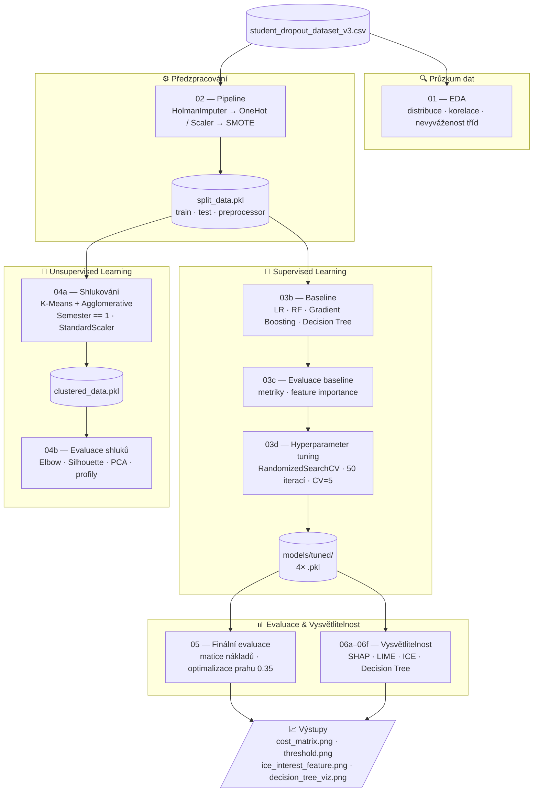

# Predikce předčasného ukončení studia (Student Dropout Prediction)

Semestrální práce na předmět **Zpracování informací a znalostí**.  
Cílem je vytvořit celý ML pipeline — od průzkumné analýzy přes klasifikační a shlukovací modely až po vysvětlitelnost predikce (XAI).

**Zdroj dat:** [Student Dropout Prediction Dataset (Kaggle)](https://www.kaggle.com/datasets/meharshanali/student-dropout-prediction-dataset)

---

## Byznys kontext

Škola chce identifikovat studenty ohrožené odchodem (dropout), aby jim mohla nabídnout cílenou podporu (stipendium, úpravu studijní zátěže). Včasná intervence šetří náklady na ztracené školné a zlepšuje reputaci školy.

### Přizpůsobení zadání

| Parametr | Hodnota |
|---|---|
| **Cílový atribut** | `Target` — 1 = Dropout, 0 = Dostuduje |
| **Vybraná instance** | Rizikový student z testovací množiny |
| **Atribut zájmu** | `Study_Hours_per_Day` (počet hodin studia denně) |
| **Podmnožina pro shlukování** | Studenti 1. semestru (`Semester == 1`) |
| **Matice nákladů** | TP = +45 000 Kč, FP = −5 000 Kč, FN = −50 000 Kč, TN = 0 Kč |
| **Doporučený klasifikační práh** | 0.35 (maximalizuje čistý finanční přínos) |

---

## Struktura projektu

```
student dropout/
│
├── notebooks/                               # Jupyter notebooky (pipeline)
│   ├── 01-exploratory-data-analysis.ipynb   # EDA: distribuce, korelace, třídy
│   ├── 02-data-preprocessing.ipynb          # Pipeline: imputace, škálování, SMOTE
│   ├── 03a-dummy-baseline.ipynb             # Dummy klasifikátor (referenční bod)
│   ├── 03b-baseline-models.ipynb            # Baseline: LR, RF, GB, DT
│   ├── 03c-baseline-evaluation.ipynb        # Metriky baseline modelů, feature importance
│   ├── 03d-hyperparameter-tuning.ipynb      # RandomizedSearchCV + HP tabulky
│   ├── 04a-clustering-model.ipynb           # K-Means + Agglomerative (studenti 1. sem.)
│   ├── 04b-clustering-evaluation.ipynb      # PCA vizualizace, profily shluků
│   ├── 05-model-evaluation.ipynb            # Matice nákladů, práh, finální srovnání
│   ├── 06a-xai-setup.ipynb                  # Příprava XAI kontextu (instance, feature)
│   ├── 06b-shap-n-ice-global.ipynb          # SHAP globální + ICE top featur
│   ├── 06c-shap-local.ipynb                 # SHAP lokální: rizikový vs. bezpečný student
│   ├── 06d-lime-explanations.ipynb          # LIME: lokální lineární aproximace
│   ├── 06e-xai-cross-comparison.ipynb       # Křížové srovnání SHAP x ICE x Feature Imp.
│   └── 06f-decision-tree-explanation.ipynb  # DT vizualizace + predikce pro vybraného stud.
│
├── data/
│   ├── student_dropout_dataset_v3.csv       # Zdrojový dataset (Kaggle)
│   └── processed/
│       ├── split_data.pkl                   # Train/test split + preprocessor
│       └── clustered_data.pkl               # Výstup shlukování (K-Means + scaler)
│
├── models/
│   ├── baseline/                            # Baseline modely (před tuningem)
│   │   ├── logistic_regression.pkl
│   │   ├── random_forest.pkl
│   │   ├── gradient_boosting.pkl
│   │   └── decision_tree.pkl
│   ├── tuned/                               # Doladěné modely (po RandomizedSearchCV)
│   │   ├── logistic_regression_tuned.pkl
│   │   ├── random_forest_tuned.pkl
│   │   ├── gradient_boosting_tuned.pkl
│   │   └── decision_tree_tuned.pkl
│   ├── kmeans_final.pkl                     # Finální K-Means model
│   ├── pca_2d.pkl                           # PCA pro vizualizaci shluků
│   └── cluster_scaler.pkl                   # StandardScaler pro clustering
│
├── results/
│   ├── hp_search_*.csv                      # Tabulky HP kombinací (všechny modely)
│   ├── cost_matrix_tuned.png                # Graf čistého přínosu (matice nákladů)
│   ├── threshold_analysis_tuned.png         # Analýza optimálního prahu
│   ├── decision_tree_viz.png                # Vizualizace DT (prvních 3 úrovně)
│   └── xai/
│       ├── ice_interest_feature.png         # ICE pro atribut zájmu
│       └── xai_context.pkl                  # Kontext pro XAI notebooky
│
├── customTransformers/
│   └── holman_imputer.ipynb                 # Vlastní transformer: HolmanImputer
│
├── run_all.py                               # Spouštěč všech notebooků v pořadí
└── requirements.txt                         # Python závislosti
```

---

## Jak spustit

### 1. Příprava prostředí

```bash
# Naklonujte repozitář
git clone <odkaz-na-repo>
cd "student dropout"

# Vytvořte virtuální prostředí (Python 3.12)
python3 -m venv .venv
source .venv/bin/activate        # Mac/Linux
# nebo: .venv\Scripts\activate   # Windows

# Nainstalujte závislosti
pip install -r requirements.txt
```

### 2. Data

Stáhněte dataset z Kagglu a uložte jako `data/student_dropout_dataset_v3.csv`.  
Složka `data/` je v `.gitignore` — data **nikdy nepushujte na GitHub**.

### 3. Spuštění pipeline

```bash
# Spuštění všech notebooků v pořadí (výstupy se zapíší přímo do .ipynb)
python run_all.py

# Spuštění od konkrétního notebooku (po opravě chyby)
python run_all.py --from 03d

# Spuštění pouze vybraných notebooků
python run_all.py --only 04a 04b
```

> Každý notebook má timeout 10 minut. Pokud notebook selže, `run_all.py` zastaví pipeline a vypíše, od kde spustit znovu.

---

## ML Pipeline — přehled



### Předzpracování (`02`)

- Vlastní transformer **HolmanImputer**: imputuje `Semester_GPA` mediánem, vypočítá feature `GPA_trend = CGPA − Semester_GPA`, poté `Semester_GPA` zahodí
- `ColumnTransformer`: OneHotEncoder pro kategorické, StandardScaler pro numerické příznaky
- **SMOTE** přes `ImbPipeline` (imbalanced-learn) pro vyvážení tříd v trénovací množině
- Celý preprocessor je enkapsulován v sklearn Pipeline — nulový data leakage

### Modely

| Notebook | Modely | Metoda |
|---|---|---|
| `03b` baseline | LR, RF, GB, DT | `cross_val_score` (5-fold) |
| `03d` tuning | LR, RF, GB, DT | `RandomizedSearchCV` (50 iterací, CV=5) |
| `04a/b` clustering | K-Means, Agglomerative | Elbow + Silhouette, StandardScaler, PCA |

### Evaluace (`05`)

- Matice nákladů aplikována na všechny tuned modely
- Analýza klasifikačního prahu (0.10–0.90) pro maximalizaci čistého přínosu
- **Doporučený práh: 0.35** (výrazně zvyšuje Recall třídy Dropout)

### XAI (`06a–06f`)

| Metoda | Notebook | Co ukazuje |
|---|---|---|
| **SHAP global** | `06b` | Průměrná důležitost příznaků přes všechny modely |
| **ICE + PDP** | `06b` | Efekt top příznaků na predikci (subpopulace) |
| **ICE — atribut zájmu** | `06b` | Jak by se predikce změnila při úpravě `Study_Hours_per_Day` |
| **SHAP local** | `06c` | Porovnání rizikového vs. bezpečného studenta |
| **LIME** | `06d` | Lokální lineární aproximace pro vybraného studenta |
| **Křížové srovnání** | `06e` | SHAP konsensus x feature importance x ICE heterogenita |
| **Decision Tree** | `06f` | Vizualizace pravidel (max_depth=3) + predikce instance |

---

## Technická poznámka: vizuální styl

Všechny grafy používají jednotný styl definovaný v prvním code cell každého notebooku:

- **Paleta:** Paul Tol Bright (`#0077BB`, `#EE7733`, `#009988`, `#CC3311`, …) — colorblind-safe, doporučovaná pro vědecké publikace
- **Pozadí os:** `#F8F9FA` (jemný off-white), bez pravého a horního spine
- **Grid:** solidní, světle šedý (`#E9ECEF`), pod daty
- **Font:** Helvetica Neue / Arial, titulky 14 pt bold

---

## Závislosti

Viz `requirements.txt`. Klíčové knihovny:

- `scikit-learn >= 1.3` — modely, pipeline, ICE/PDP
- `imbalanced-learn >= 0.11` — SMOTE (ImbPipeline)
- `shap >= 0.42` — globální i lokální vysvětlitelnost
- `lime >= 0.2` — lokální lineární aproximace
- `matplotlib >= 3.7` + `seaborn >= 0.12` — vizualizace
